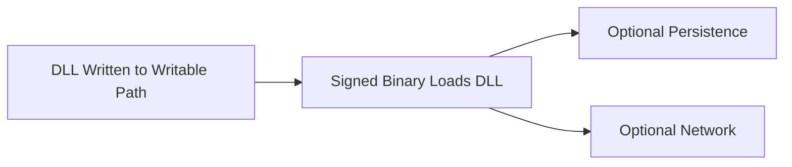

# Threat Hunting Philosophy & Detection Design

**Author:** Ala Dabat  
**Focus:** Practical, adversary-informed threat hunting for real SOC environments  
**Audience:** L2 / L2.5 Threat Hunters, Detection Engineers, Security Leads  

---

## Why This Repository Exists

Most SOCs fail at threat hunting not because they lack tools, but because:

- Detections are **over-engineered**
- Behavioural chains are **forced where they are not required**
- Analysts are flooded with **noise disguised as intelligence**
- Rules are written without regard for **operational reality**

This repository documents a **deliberate, practical methodology** for building threat hunts that:

- Scale to real SOC teams
- Preserve signal fidelity
- Reduce analyst fatigue
- Use behavioural logic **only when it is genuinely required**

---

## Core Philosophy (TL;DR)

> **Start with the minimum truth required for the attack to exist.**  
> Everything else is reinforcement — not dependency.

---

## The Detection Maturity Model I Use

### 1. Reductive Baseline (Truth First)

Every attack has a **minimum condition that must be true**.

Examples:
- LSASS credential access → *LSASS must be accessed*
- Service persistence → *A service must be created or modified*
- DLL sideloading → *A DLL must be written AND loaded*

If this condition is not met, the attack is **not real**.

---

### 2. Composite L2 Hunts (Default)

Most attacks **do not require full behavioural chains**.

Instead, we group **related high-signal indicators** into **composite hunts** that:
- Share a clear attack goal
- Use a single telemetry source (where possible)
- Are explainable to L2 analysts
- Generate **actionable investigations**

This is where **most threat hunting should live**.

---

### 3. Reinforcement (Scoring, Context, Rarity)

Once the baseline truth is met, we **reinforce confidence** using:

- Parent/child relationships
- Network proximity
- File paths
- Rarity / prevalence
- Timing correlation

Reinforcement **improves fidelity** — it should never be required for truth.

---

### 4. Behavioural Chains (Used Sparingly)

Behavioural correlation is **only used when an attack cannot exist without it**.

This is the exception — not the rule.

---

## Composite L2 Hunt Categories (What SOCs Actually Need)

| Category | Why It Matters | Telemetry |
|--------|---------------|-----------|
| LSASS Interaction | Credential theft is universal | Process / Handle Access |
| Service Creation / Modification | High-ROI persistence | Process + Registry |
| Account Manipulation | Auditors & blue teams expect it | Process / Identity |
| Archive & Staging | Pre-exfiltration signal | Process |
| LOLBin Ingress | Initial access & payload delivery | Process |

Each category is implemented as **L2 or L2.5 composite hunts** with:
- Clear intent
- Low noise
- Built-in Hunter Directives

---

## Built-In Hunter Directives (Non-Negotiable)

Every hunt produces **guidance alongside results**, not after.

Directives answer:
- Why this fired
- What makes it suspicious
- What to check next
- When to escalate

This ensures:
- Junior analysts can triage confidently
- Senior analysts don’t re-investigate basics
- Knowledge is encoded into the detection itself

---

## When Behavioural Detection *Is* Required (One Justified Example)

### Example: DLL Sideloading (Search Order Hijacking)

**MITRE:** T1574.001  
**Why this example:**  
DLL sideloading **cannot be confirmed from a single signal**.

---

### Why L2 Alone Is Insufficient

| Signal | Alone | Verdict |
|-----|------|--------|
| DLL dropped to writable path | Common | ❌ |
| DLL loaded by signed binary | Normal | ❌ |

**The attack is only true when both occur together.**

---

### Minimum Behavioural Truth

| Step | Required | Reason |
|----|----|------|
| DLL written to attacker-controlled path | ✅ | Establishes payload |
| Loaded by legitimate binary | ✅ | Confirms hijack |
| Persistence / Network | ❌ Optional | Reinforcement only |

---

### Behavioural Chain (Justified)

